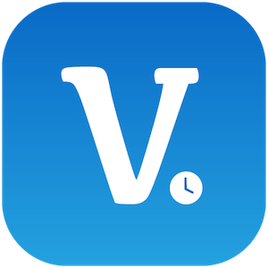
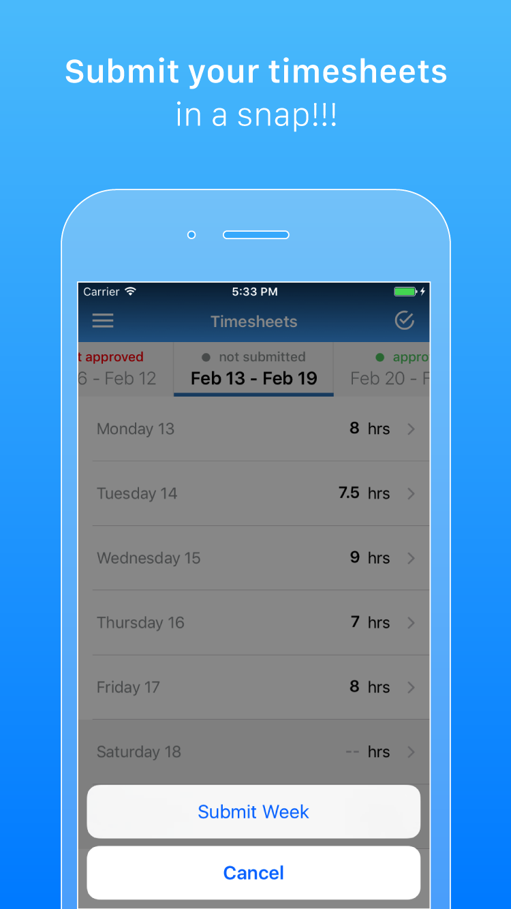
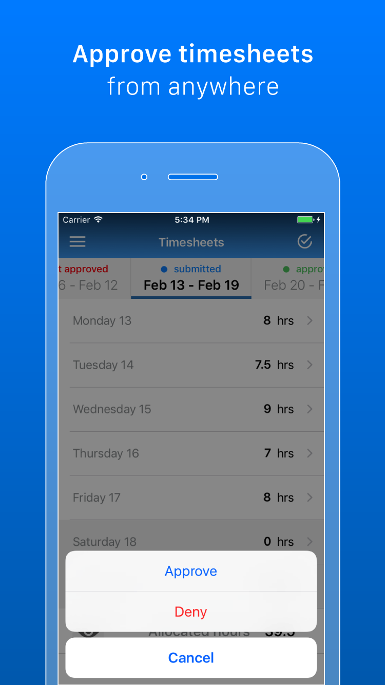

  

# Volta 

Volta is an iOS app for timesheet management. With it, employees can submit their work times for the week and managers can approve or deny their timesheets. Also, admin users can have an eagle-eye view of the organization and see the status of the timesheets of the employees.

All of this in real time as it leverages Firebase's realtime database.

You can easily implement it in your company (and for free!) by changing the Firebase instance it's pointing to.

## Getting Started

### Prerequisites

To have your own Volta, you will need:
- A Firebase account (free)
- Carthage (for building EPSignature)
- Cocoapods (for the rest of the frameworks)

### Setup

1. Create your Firebase account and set up your app in the Firebase console.
2. Replace the [GoogleService-Info.plist](Volta/Firebase/GoogleService-Info.plist) and [GoogleService-Info-dev.plist](Volta/Firebase/GoogleService-Info-dev.plist) files for the one provided for your app by Google. ([They can be different if you want a different Firebase instance for dev](https://gist.github.com/cohenadair/3a2aff5084603bfa65824f09cf74206e)).
3. Create your first admin user from the Firebase console.
4. Copy the generated User UID.
5. Replace the first user in the _users_ node in [Firebase\_initial\_DB.json](Resources/Firebase_initial_DB.json) with your first admin user data, including the generated User UID.
6. Import your modified Firebase\_initial\_DB.json into the Database section of the Firebase console.
7. Run the app and login with your admin user to start creating managers and employees.

## Features

### Employees
- Enter their timesheets, specify projects worked on the day and send to submission.
- Upload a picture of a paper or screen timesheet if required by attaching to the timesheet week.

### Managers
- Approve or don't approve the week timesheet entered by employees.

### Admins
- Manage managers and employees in the company.
- Manage projects and assign them to employees.
- Export timesheet week report to PDF.

### Everyone
- See an overview of the approval status of the timesheets. 
- Receive notifications for timesheet submission (Manager), submission reminders (Employee) and project overtime (Admin). (Requires Apple Push Notification Service certificates)

## Screenshots

    

## Built with
- [Firebase][1] - Realtime database, authentication, storage and notifications.
- [LGSideMenuController][2] - Side menu.
- [ActionSheetPicker][3] - Picker modal for choosing options.
- [iOS-htmltopdf][4] - For exporting the timesheets to PDF
- [MBProgressHUD][5] - Progress indicator.
- [NYTPhotoViewer][6] - Image viewer for timesheets photos.
- [EPSignature][7] - For the first time managers login, to record their signature.

[1]: https://firebase.google.com
[2]: https://github.com/Friend-LGA/LGSideMenuController
[3]: https://github.com/skywinder/ActionSheetPicker-3.0
[4]: https://github.com/iclems/iOS-htmltopdf
[5]: https://www.github.com/jdg/MBProgressHUD
[6]: https://github.com/NYTimes/NYTPhotoViewer
[7]: https://github.com/ipraba/EPSignature

## Known issues
- Incorrect appearance of the navigation bar in iPhone X.
- For admin users, progress indicator is not disappearing if there are no employees on the database. Create at least one employee to avoid this.
- At startup, the selected week is the week before the current one and not the current one.

## Author

* **Jonathan Cabrera** - [LinkedIn](https://www.linkedin.com/in/jcabreram/en)
            
## License

This project is licensed under the Apache License - see the [LICENSE](LICENSE) file for details
